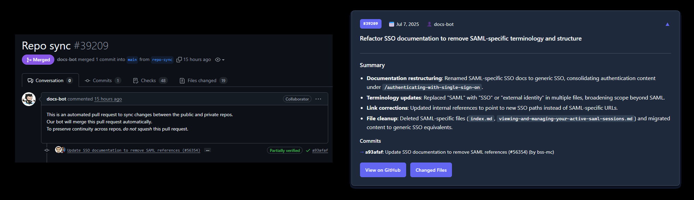

# pr-summary

`github/docs` Pull Requests have awful titles.
To make it easier to follow changes, this gives you AI-powered summaries of their Pull Requests

Check out [`pr.tim.ad`](https://pr.tim.ad) to see it in action!



## Overview

* `src` - Python code for fetching PRs, calling OpenRouter to analyze PRs
   * `generate_summary.py` - Script to generate summaries for a specific PR
   * `generate_website_data.py` - Script to generate the `pr-data.json` file
   * `list_prs_without_summaries.py` - Script to list PRs that need summaries
* `app` - React web app for displaying PR summaries, hosted on GitHub Pages
* `data` - JSON files containing PR data summaries for `github/docs`
* `.github/workflows`
   * `deploy-website.yml` - deploy the React app with the Pull Request data to GitHub Pages
   * `generate.yml` - list PRs that need summaries and generate them, push them to `data/`

## Local Development

### PR Analysis

1. Install Python dependencies:
   ```bash
   pip install -r requirements.txt
   ```
2. Set your OpenRouter API key in your environment:
   ```bash
   export OPENROUTER_API_KEY='your_api_key'
   ```
3. Run the analysis script:
   ```bash
   python3 generate_summary.py --repo github/docs --pr 12345
   ```

### React app

1. Analyze some PRs to create data files
2. Run `generate_website_data.py` to generate the `pr-data.json` file
3. Install Node.js dependencies:
   ```bash
   cd app
   npm install
   ```
4. Start the React app:
   ```bash
   npm start
   ```

The website will be available at `http://localhost:3000`.
